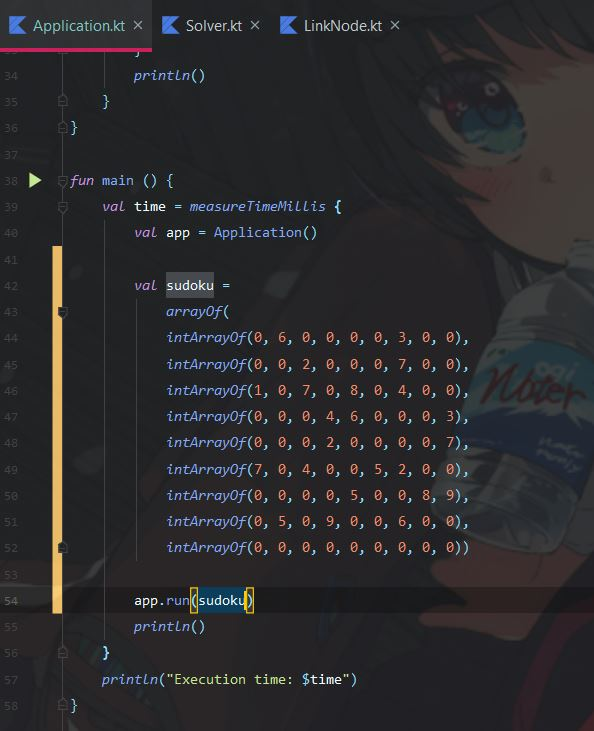
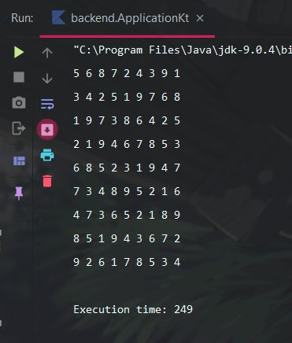

# README

This project is able to complete a Sudoku puzzle in really short time.
The project shown knowledge on Dancing Links and Algorithm X, to solve exact cover problem.
The system solves any 9x9 grid Sudoku (hardcoded grid size for now), and it can also solve Sudoku of other size (4x4, 25x25, etc).

The program takes an array of IntArray as the raw Sudoku grid and output an array of IntArray as the output.

### Input

### Output

